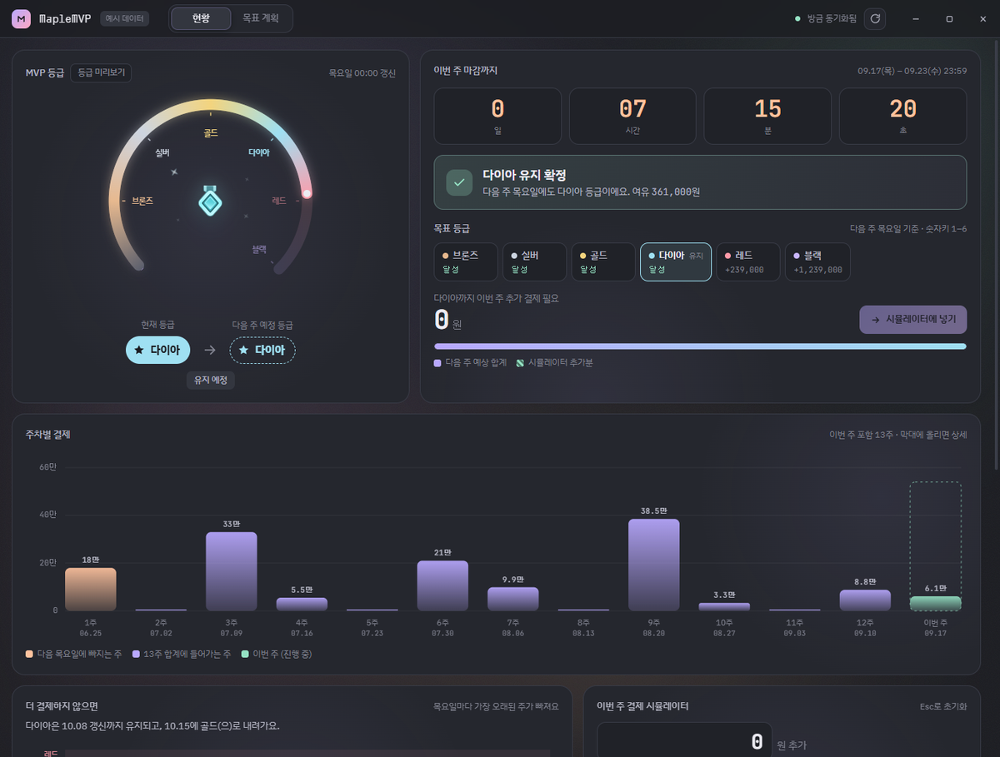
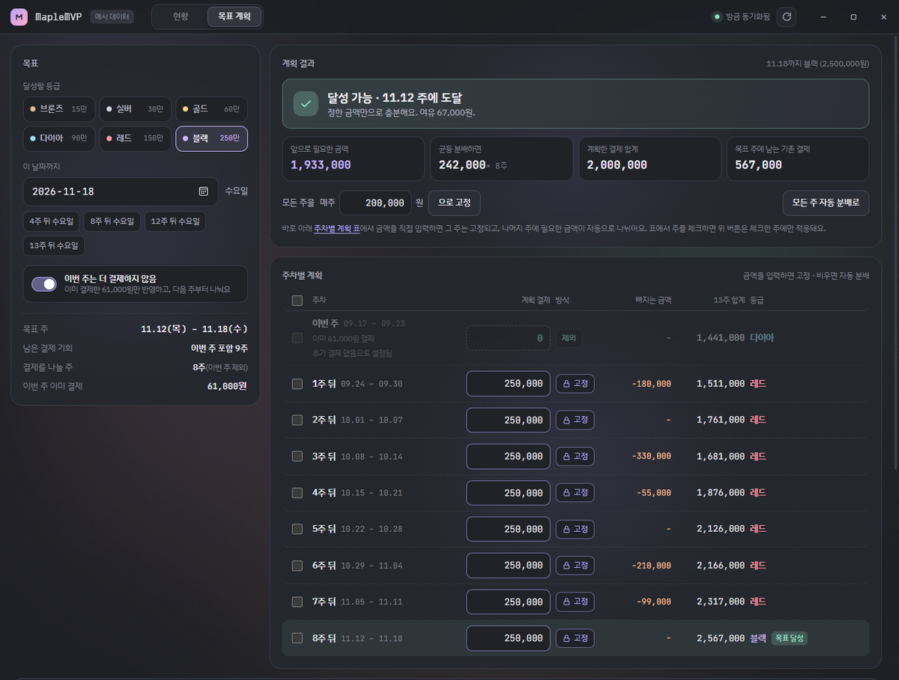
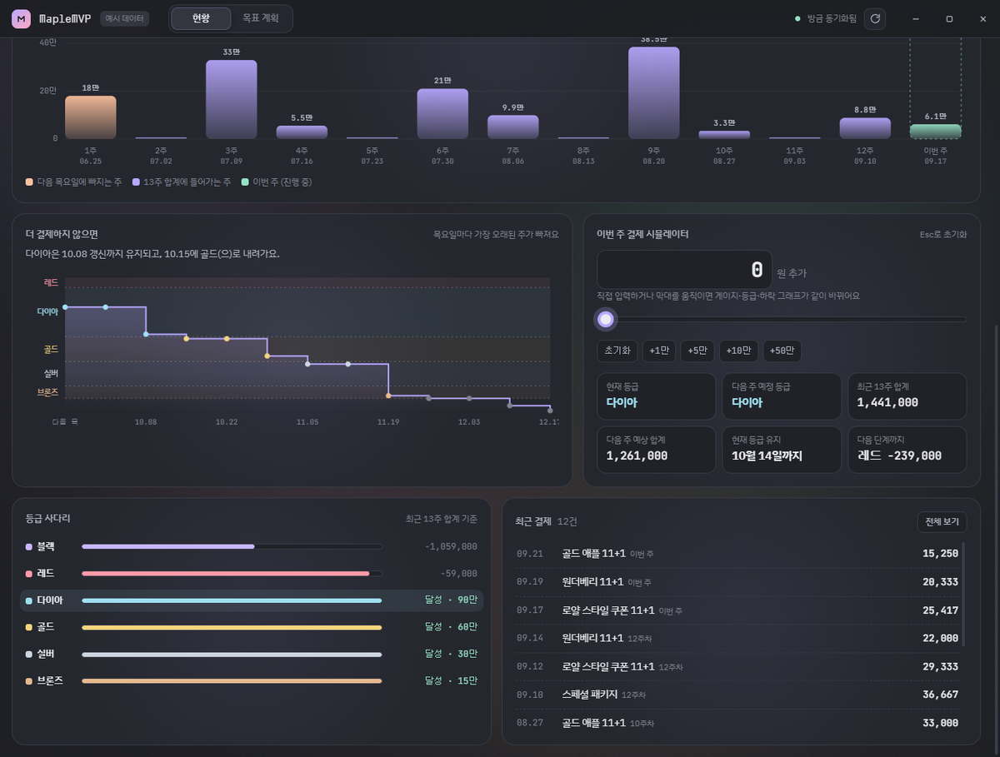
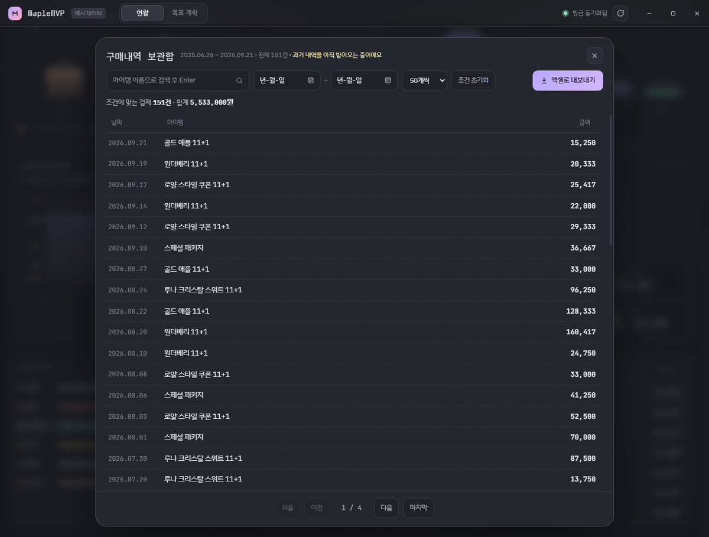

<h1 align="center">MapleMVP</h1>

<p align="center">메이플스토리 결제 내역을 읽어서 MVP 등급 현황과 목표 계획을 보여주는 윈도우 데스크톱 앱</p>

<p align="center">
  
</p>

넥슨 공식 도구가 아니다. 넥슨 계정으로 로그인한 뒤 본인 계정의 구매내역 페이지를 읽어서 계산해 보여주는 것이 전부이고, 데이터는 전부 이 PC에만 저장된다.

## 할 수 있는 것

- 최근 13주 결제 합계와 현재 등급, 다음 목요일에 적용될 등급
- 이번 주 마감까지 남은 시간, 등급을 유지하거나 올리는 데 더 필요한 금액
- 이번 주에 얼마를 더 결제하면 무엇이 달라지는지 (시뮬레이터)
- 언제까지 어떤 등급을 달성하려면 매주 얼마씩 결제해야 하는지 (목표 계획)
- 지난 구매내역 전체를 검색·정렬하고 엑셀로 내보내기 (보관함)
- 블랙 기준을 넘긴 금액의 이월 계산

<table>
<tr>
<td width="50%">

<sub><b>목표 계획</b> — 목표 등급과 날짜를 정하면 남은 주에 금액을 나눠준다. 특정 주의 금액을 직접 입력해 고정하면 나머지 주가 다시 계산된다. 이번 주는 더 결제하지 않는 것으로 두고 계산할 수도 있다.</sub>
</td>
<td width="50%">

<sub><b>하락 예측 · 시뮬레이터</b> — 더 결제하지 않으면 언제 어느 등급으로 내려가는지, 추가 결제가 등급·합계·하락 시점을 어떻게 바꾸는지 보여준다.</sub>
</td>
</tr>
<tr>
<td colspan="2">

<sub><b>구매내역 보관함</b> — 첫 실행 때 받아둔 지난 구매내역 전체. 아이템 이름 검색, 기간 필터, 헤더를 눌러 정렬, 보고 있는 목록 그대로 엑셀 저장.</sub>
</td>
</tr>
</table>

<sub>스크린샷은 모두 예시 데이터(`python run.py --demo`)로 찍은 것이다.</sub>

## MVP 등급 기준

앱이 계산에 쓰는 규칙이다.

| 등급 | 13주 합계 |
| --- | --- |
| 브론즈 | 150,000원 |
| 실버 | 300,000원 |
| 골드 | 600,000원 |
| 다이아 | 900,000원 |
| 레드 | 1,500,000원 |
| 블랙 | 2,500,000원 |

- 한 주는 목요일 00:00에 시작해서 수요일 23:59에 끝난다.
- 판정에 쓰는 13주는 **이번 주를 포함한** 최근 13주다.
- 결제하면 등급은 바로 오르고, 목요일마다 가장 오래된 주가 빠지면서 다시 계산된다.
- 블랙 기준(250만원)을 넘긴 금액은 이월되어, 나중에 기준에 모자랄 때 부족분을 메운다. 이월 한도는 1,000만원이다.

## 설치와 실행

### 빌드된 exe로 쓰기

`MapleMVP.exe` 파일 하나만 있으면 된다. 설치 과정은 없고 아무 폴더에 두고 실행하면 된다. 코드 서명이 없어서 처음 실행할 때 윈도우 SmartScreen 경고가 뜨는데, `추가 정보` → `실행`을 누르면 된다.

### 소스에서 실행하기

필요한 것: 윈도우 10/11, Python 3.10 이상, Node.js 20 이상. WebView2 런타임은 윈도우 11에 기본으로 들어 있다.

```
python -m venv venv
venv\Scripts\pip install -r requirements.txt

cd frontend
npm install
npm run build
cd ..

venv\Scripts\python run.py
```

단일 exe로 빌드하려면 (`dist\MapleMVP.exe`가 만들어진다):

```
powershell -ExecutionPolicy Bypass -File tools\build.ps1
```

로그인이나 수집 없이 화면만 둘러보려면 `venv\Scripts\python run.py --demo`.

## 처음 실행할 때

1. 넥슨 로그인 창이 뜬다. 넥슨 공식 로그인 페이지이고, 로그인하면 창이 알아서 닫힌다.
2. 구매내역을 받아오기 시작한다. 처음 한 번은 지난 구매내역을 전부 받아오기 때문에 몇 분 걸릴 수 있다. 진행 상황에 지금까지 받은 건수가 표시된다.
3. 그 다음부터는 이번 달치만 새로 읽어서 몇 초면 끝난다.

첫 수집 도중에 창을 닫아도 받은 만큼은 저장되고, 다음에 켜면 끊긴 지점부터 이어받는다.

## 저장되는 파일

전부 `%LOCALAPPDATA%\MapleMVP\` 안에 있다. 이 폴더를 지우면 완전히 처음 상태가 된다.

| 파일 | 내용 |
| --- | --- |
| `cache.json` | 받아온 구매내역 |
| `plan.json` | 목표 계획 (목표 등급, 날짜, 주별 고정 금액) |
| `ui.json` | MVP 카드 가운데에 메달을 볼지 금액을 볼지 |
| `settings.json` | 창 크기·위치, 로그인 여부 |
| `webview\` | 넥슨 로그인 상태 (쿠키) |

## 자주 묻는 것

**아이디와 비밀번호를 앱이 보나?**
아니다. 로그인은 넥슨 로그인 페이지가 열린 창에서 이뤄지고, 앱은 그 결과인 로그인 상태(쿠키)만 이 PC에 저장한다. 앱이 접속하는 곳은 넥슨 사이트뿐이고, 어디로도 데이터를 보내지 않는다.

**다른 브라우저에서 넥슨에 로그인하면?**
중복 로그인으로 처리되어 앱의 세션이 끊긴다. 다음에 실행하면 받아둔 내역으로 화면은 먼저 뜨고, 그 위에 로그인 안내가 나온다. 다시 로그인하면 이번 달치만 새로 읽으므로 금방 끝난다.

**이월 금액은 어디서 가져오나?**
넥슨이 알려주는 값이 아니라서 앱이 계산한다. 과거 주차별 결제액을 목요일마다 되짚으면서 블랙 기준을 넘긴 금액을 쌓고, 모자란 주에서 꺼내 쓰는 식이다. 그래서 첫 수집 때 최근 1년 이상의 기록이 필요하다.

**표시된 등급이 게임 안과 다르다면?**
우측 상단의 새로고침을 눌러 최신 내역을 다시 읽어보면 된다. 그래도 다르면 이 앱이 쓰는 규칙(위의 등급 기준)이 실제와 어긋난 것이니, 공식 안내를 따르면 된다.

**맥이나 리눅스에서 되나?**
안 된다. WebView2와 Win32 API를 쓰기 때문에 윈도우 전용이다.

**갑자기 수집이 실패한다면?**
넥슨 구매내역 페이지의 구조가 바뀌면 읽지 못할 수 있다. 페이지를 읽는 코드는 `app/scrape.js` 한 파일에 모여 있다.

## 구조

```
app/        pywebview 셸, 넥슨 구매내역 수집, MVP 등급 계산, 로컬 캐시
frontend/   Svelte 5 + Vite + Tailwind 대시보드
tools/      exe 빌드, 아이콘·바로가기 생성 스크립트
tests/      등급·이월·목표 계획 계산 테스트
```

계산 로직은 `app/mvp.py`에 모여 있고 `venv\Scripts\python -m pytest`로 테스트할 수 있다.

## 라이선스

[MIT](LICENSE)
